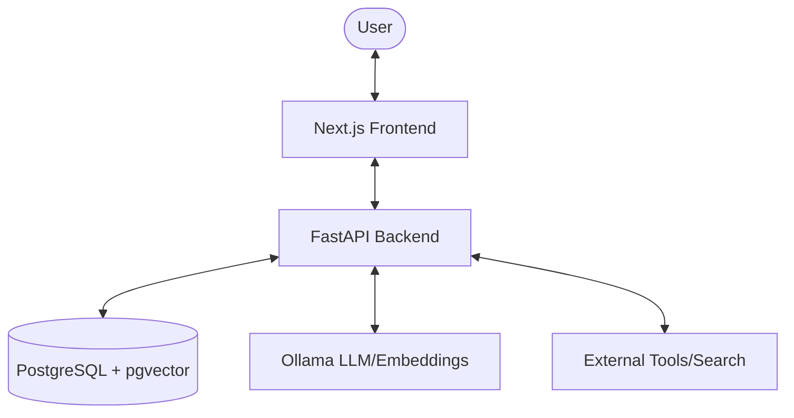

# JGPT Architecture

JGPT is an Enterprise Retrieval-Augmented Generation (RAG) system designed for high-performance, private, and agentic knowledge retrieval.

## System Overview

## Core Components

### 1. JGPT Web (Frontend)
- **Technology**: Next.js 15+, React 18+, Tailwind CSS.
- **Features**: Chat interface, source citations, history management, and administrative panels for ingestion monitoring.

### 2. JGPT API (Backend)
- **Technology**: FastAPI, Pydantic, SQLAlchemy.
- **RAG Engine**:
    - **Semantic Chunking**: Context-aware splitting of documents.
    - **Department Awareness**: Multi-tenant or siloed knowledge retrieval.
    - **Hybrid Search (RRF)**: Advanced Reciprocal Rank Fusion blending Vector and Full-Text Search scores for superior relevance.
    - **Multimodal Vision**: Automated image captioning and description injection into context.
- **Agentic Layer**: Built-in support for tool calling and multi-step reasoning.

### 3. Knowledge Base & Ingestion
- **Storage**: Raw documents stored in `kb/`, vectorized data in PostgreSQL.
- **Ingestion Pipeline**: 
    - Automated PDF/Text processing.
    - Web crawling via `ingest_web.py`.
    - Knowledge distillation via Ollama.

### 4. Database Schema
- **pgvector**: Used for high-dimensional embedding storage and ANN search.
- **Metadata Filtering**: Robust filtering by department, source, and timestamps.

## Deployment
The entire stack is containerized using Docker, allowing for one-command deployment on-premise or in the cloud. Configuration is managed via unified environment variables.
